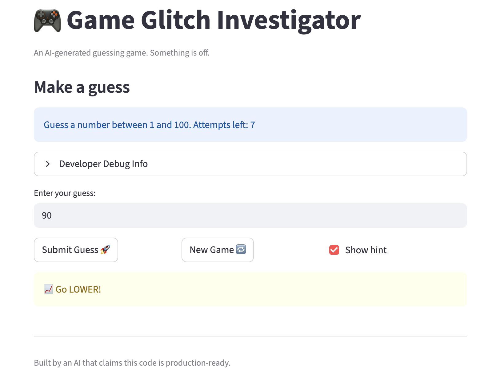
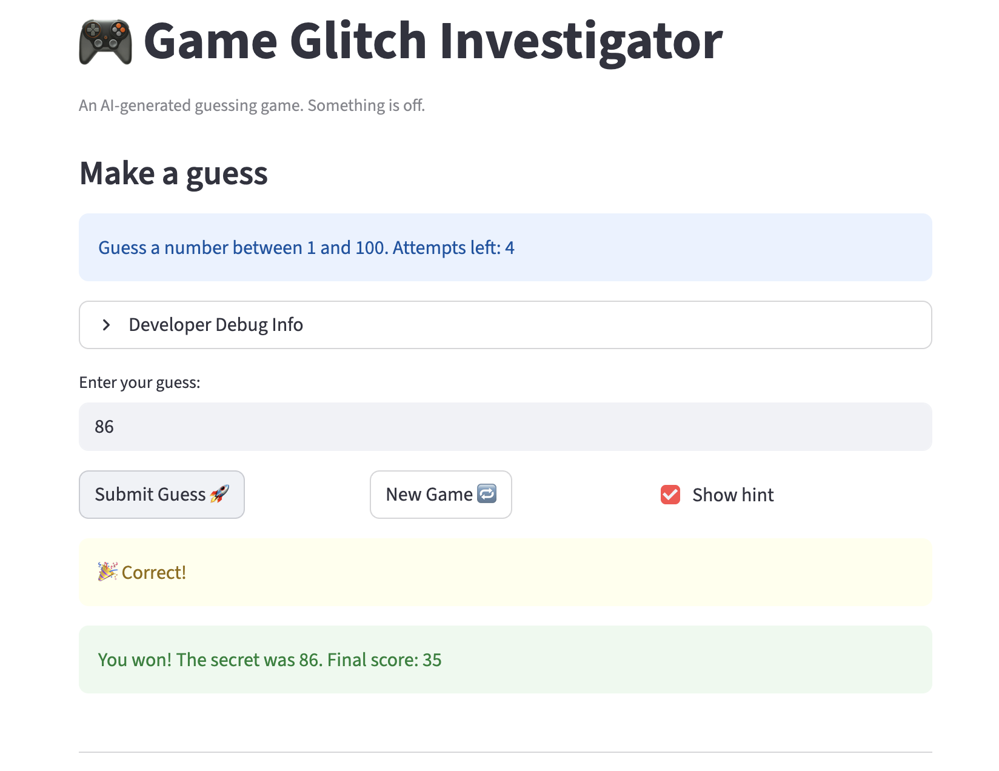
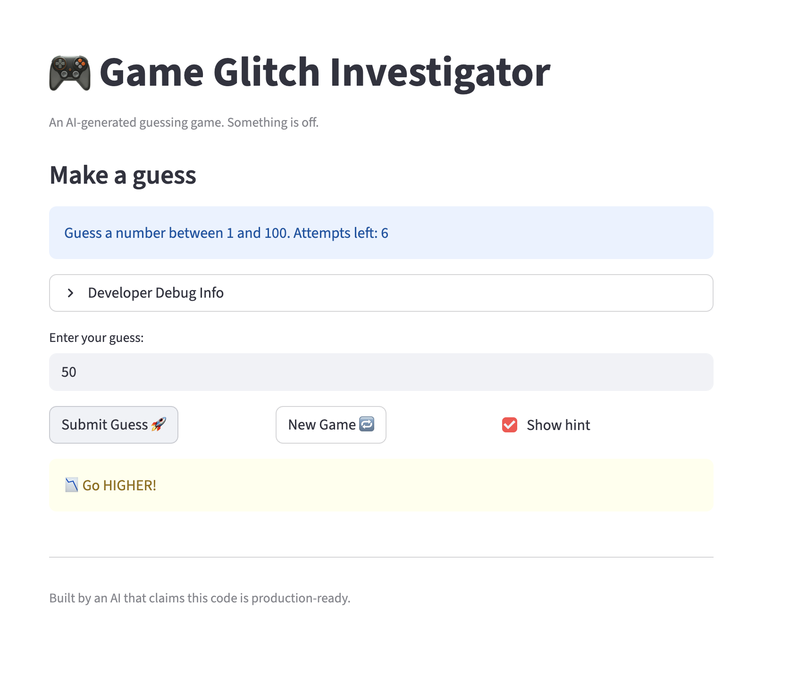

# 🎮 Game Glitch Investigator: The Impossible Guesser

## 🚨 The Situation

You asked an AI to build a simple "Number Guessing Game" using Streamlit.
It wrote the code, ran away, and now the game is unplayable. 

- You can't win.
- The hints lie to you.
- The secret number seems to have commitment issues.

## 🛠️ Setup

1. Install dependencies: `pip install -r requirements.txt`
2. Run the broken app: `python -m streamlit run app.py`

## 🕵️‍♂️ Your Mission

1. **Play the game.** Open the "Developer Debug Info" tab in the app to see the secret number. Try to win.
2. **Find the State Bug.** Why does the secret number change every time you click "Submit"? Ask ChatGPT: *"How do I keep a variable from resetting in Streamlit when I click a button?"*
3. **Fix the Logic.** The hints ("Higher/Lower") are wrong. Fix them.
4. **Refactor & Test.** - Move the logic into `logic_utils.py`.
   - Run `pytest` in your terminal.
   - Keep fixing until all tests pass!

## 📝 Document Your Experience

- [ ] Describe the game's purpose.
- [ ] Detail which bugs you found.
- [ ] Explain what fixes you applied.

During this project I used GitHub Copilot and ChatGPT to help identify and fix bugs in the AI-generated code.

One issue I discovered was that the hint messages were reversed. When the guess was higher than the secret number, the game incorrectly told the user to guess higher. After reviewing the `check_guess` function, I corrected the hint logic so it now provides accurate feedback.

Another issue was that some game logic was mixed with UI code in `app.py`. I refactored the core logic functions into a separate file called `logic_utils.py`. This made the code easier to test and maintain.

To verify the fixes, I added automated tests using pytest in `tests/test_game_logic.py`. These tests check that the `check_guess` function correctly returns "Win", "Too High", and "Too Low". Running `pytest` confirmed that all tests pass and the logic works as expected.

This project helped me understand how AI-generated code can contain logical errors and why testing and debugging are important when working with AI tools.

## 📸 Demo

### Winning Game Screen

### Game Hint Example

### Pytest Results

- [ ] [Insert a screenshot of your fixed, winning game here]

## 🚀 Stretch Features
No additional stretch features were implemented in this version.

- [ ] [If you choose to complete Challenge 4, insert a screenshot of your Enhanced Game UI here]
